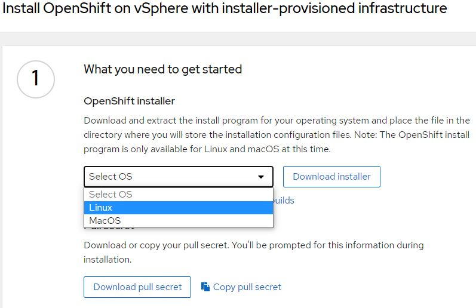

# Установка Red Hat Openshift на платформу VMware

В данной статье будет рассмотрена установка 3х-узлового кластера Опеншифт с использованием автоматического инсталлятора (IPI) на платформу виртуализации от VMware.

Используемые версии ПО:
* VMware vSphere 6.7.0
* Red Hat Openshift 4.7.13
* Red Hat Enterprise Linux 8 (виртуальная машина, с которой производилась установка)

Документация:
https://docs.openshift.com/container-platform/4.7/installing/installing_vsphere/installing-vsphere-installer-provisioned-customizations.html

## Сетевая инфраструктура

В текущей инсталляции установка производилась в отдельный VLAN. 

DHCP-сервер настроен на выдачу адресов в диапазоне 10.17.49.65-10.17.49.127

Статические адреса, необходимые для функционирования платформы:

1. 10.17.49.5 - API VIP
2. 10.17.49.6 - Ingress (apps) VIP

## Настройка DNS-сервера

Потребуется использование и минимальная настройка DNS-сервера.

Необходимо внести 2 записи типа A для следующих имен:

1. api.vmw-cluster01.ocp4.test
2. *.apps.vmw-cluster01.ocp4.test (wildcard)

-где _vmw-cluster01_ имя кластера, а _ocp4.test_ используемый домен.
На примере рассматриваемой инсталляции, в качестве DNS-сервера используется Red Hat Identity Management:


## Генерация и использование ssh-ключа (опционально)

Набор команд для генерации ssh-ключа и его добавления в ssh-agent:

```
$ ssh-keygen -t ed25519 -N '' -f ~/.ssh/id_rsa
$ eval "$(ssh-agent -s)"
$ ssh-add .ssh/id_rsa
```

## Загрузка программы-инсталлятора и pull-secret

Для загрузки инсталлятора платформы Openshift, потребуется доступ к порталу https://cloud.redhat.com/

После входа на портал, переходим в меню **Openshift -> Clusters -> Create cluster**. Далее, необходимо выбрать платформу, на которую будет произведена установка. В нашем случае, это виртуализация от VMware: **Datacenter -> vSphere -> Installer-provisioned infrastructure**. 

Следующим шагом, выбрать операционную систему, с которой будет происходить установка, и скачать инсталлятор:



Распаковываем полученный архив:
```
$ tar xvf openshift-install-linux.tar.gz
```

На этой же странице чуть ниже, скачать и сохранить **pull-secret**. Он потребуется при генерации файла конфигурации.

## Загрузка и добавление сертификатов vCenter в доверенные

Для того, чтобы программа-инсталлятор получила доступ к API платформы виртуализации, необходимо добавить корневые сертификаты vCenter'а в списки Доверенных на системе, откуда производится установка. Для этого, на домашней странице кликаем по ссылке **Download trusted root CA certificates**:


Далее, необходимо извлечь содержимое и скопировать файлы, в зависимости от используемой ОС. В нашем случае, показан пример распаковки и добавления сертификатов на ОС RHEL8:

```
$ unzip download.zip
$ sudo cp certs/lin/* /etc/pki/ca-trust/source/anchors
$ sudo update-ca-trust extract
```

## Создание привилегированного пользователя для доступа к платформе виртуализации
Для установки кластера Red Hat OpenShift в автоматическом режиме (IPI), инсталлятору потребуется учетная запись с правами доступа к ресурсам vCenter'а (чтение, создание, удаление ресурсов и прочее). Самый простой путь решения этой задачи - создание отдельной учетки с правами Администратора на глобальном уровне. Но такой способ не всегда является возможным по ряду причин (например связанных с вопросами безопасности). Поэтому, рекомендуется создать кастомизированный набор ролей с необходимыми для пользователя привилегиями для соответствующих объектов (таких как, Датацентр, Кластер, Датастор и т.п.). Список ролей детально расписан в [документации](https://docs.openshift.com/container-platform/4.7/installing/installing_vsphere/installing-vsphere-installer-provisioned-customizations.html#installation-vsphere-installer-infra-requirements_installing-vsphere-installer-provisioned-customizations) к платформе OpenShift.

В нашем примере, для успешной процедуры установки кластера, был создан пользователь **ocp-vmw** с правами (_Read-Only_) на глобальном уровне и 6 кастомизированных ролей с различными привилегиями (согласно списку в документации):


Более детальный список ролей с необходимыми привелегиями можно посмотреть по ссылке.
