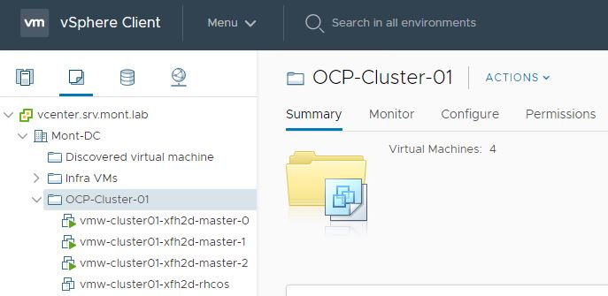

# Установка Red Hat OpenShift на платформу VMware vSphere

В данной статье будет рассмотрена установка 3х-узлового кластера Red Hat OpenShift с использованием автоматического инсталлятора (IPI) на платформу виртуализации от VMware. Установка произведена с использованием учетной записи пользователя с соответствующими привилегиями без прав Администратора к платформе vSphere.

Используемые версии ПО:
* VMware vSphere 6.7.0
* Red Hat Openshift 4.7.13
* Red Hat Enterprise Linux 8 (виртуальная машина, с которой производилась установка)

Документация:
https://docs.openshift.com/container-platform/4.7/installing/installing_vsphere/installing-vsphere-installer-provisioned-customizations.html

## Сетевая инфраструктура

В текущей инсталляции установка производилась в отдельный VLAN. 

DHCP-сервер настроен на выдачу адресов в диапазоне `10.17.49.65-10.17.49.240`

```
subnet 10.17.49.0 netmask 255.255.255.0 {

    pool {
      range 10.17.49.65 10.17.49.240;
      failover peer "failover-mont";
    }
    option routers 10.17.49.254;
    option broadcast-address 10.17.49.255;
    option subnet-mask 255.255.255.0;
    option ntp-servers 10.17.42.130, 10.17.42.134;
    option time-servers 10.17.42.130, 10.17.42.134;
    
```

Статические адреса, необходимые для функционирования платформы:

1. `10.17.49.5` - API VIP
2. `10.17.49.6` - Ingress (apps) VIP

**Важно: текущий вариант установки предполагает наличие в используемом VLAN'е постоянного доступа в интернет. Установка в закрытом контуре (где доступ в интернет организовать нет возможности) рассмотрена в соответствующем разделе [документации](https://docs.openshift.com/container-platform/4.7/installing/installing_vsphere/installing-restricted-networks-installer-provisioned-vsphere.html).**

## Настройка DNS-сервера

Потребуется использование и минимальная настройка DNS-сервера.

Необходимо внести 2 записи типа A для следующих имен:

1. `api.vmw-cluster01.ocp4.test`
2. `*.apps.vmw-cluster01.ocp4.test` (wildcard)

-где `vmw-cluster01` имя кластера, а `ocp4.test` используемый домен.
На примере рассматриваемой инсталляции, в качестве DNS-сервера используется Red Hat Identity Management:


## Генерация и использование ssh-ключа (опционально)

Набор команд для генерации ssh-ключа и его добавления в ssh-agent:

```
$ ssh-keygen -t ed25519 -N '' -f ~/.ssh/id_rsa
$ eval "$(ssh-agent -s)"
$ ssh-add .ssh/id_rsa
```

## Загрузка и добавление сертификатов vCenter в доверенные

Для того, чтобы программа-инсталлятор получила доступ к API платформы виртуализации, необходимо добавить корневые сертификаты vCenter'а в списки Доверенных на системе, откуда производится установка. Для этого, на домашней странице кликаем по ссылке **Download trusted root CA certificates**:


Далее, необходимо извлечь содержимое и скопировать файлы, в зависимости от используемой ОС. В нашем случае, показан пример распаковки и добавления сертификатов на ОС RHEL8:

```
$ unzip download.zip
$ sudo cp certs/lin/* /etc/pki/ca-trust/source/anchors
$ sudo update-ca-trust extract
```

## Создание привилегированного пользователя для доступа к платформе виртуализации
Для установки кластера Red Hat OpenShift в автоматическом режиме (IPI), инсталлятору потребуется учетная запись с правами доступа к ресурсам vCenter'а (чтение, создание, удаление ресурсов и прочее). Самый простой путь решения этой задачи - создание отдельной учетки с правами Администратора на глобальном уровне. Но такой способ не всегда является возможным по ряду причин (например связанных с вопросами безопасности). Поэтому, рекомендуется создать кастомизированный набор ролей с необходимыми для пользователя привилегиями для соответствующих объектов (таких как, Датацентр, Кластер, Датастор и т.п.). Список ролей детально расписан в [документации](https://docs.openshift.com/container-platform/4.7/installing/installing_vsphere/installing-vsphere-installer-provisioned-customizations.html#installation-vsphere-installer-infra-requirements_installing-vsphere-installer-provisioned-customizations) к платформе OpenShift.

В нашем примере, для успешной процедуры установки кластера, был создан пользователь **ocp-vmw** с правами (_Read-Only_) на глобальном уровне и 6 кастомизированных ролей с различными привилегиями (согласно списку в документации):


Более детальный список ролей с необходимыми привелегиями доступен по [ссылке](https://github.com/nirvkot/vmw-3node-cluster/blob/main/vmw-roles-list.md).

После того, как пользователь и требуемые роли созданы, необходимо настроить права доступа на соответствующие объекты согласно табличке из [мануала](https://docs.openshift.com/container-platform/4.7/installing/installing_vsphere/installing-vsphere-installer-provisioned-customizations.html#installation-vsphere-installer-infra-requirements_installing-vsphere-installer-provisioned-customizations):


Например, для добавления пользователя и роли к vSphere vCenter, переходим к объекту во вкладку **Permissions**:


Ищем нужного пользователя, в нашем случае это **ocp-vmw** в домене MONT.LAB, и выбираем соответствующую роль. Для объекта vSphere vCenter это `ocp_vCenter_Cluster`, созданная нами на предыдущих шагах.


Значение опции **Propagate to children** берется из таблицы выше. В данном случае она не нужна.

По аналогии, добавляем пользователя и необходимую ему роль для каждого объекта.

Важно отметить, что роль `ocp_vSphere_vCenter_Datacenter`, устанавливаемая для Datacenter, нужна лишь в том случае, когда инсталлятор сам создает себе папку под виртуальные машины. В текущем примере установка будет производится в созданную пользователем директорию **OCP-Cluster-01**, путь к которой указан в конфигурационном файле.

## Загрузка программы-инсталлятора и pull-secret

Для загрузки инсталлятора платформы Openshift, потребуется доступ к порталу https://cloud.redhat.com/

После входа на портал, переходим в меню **Openshift -> Clusters -> Create cluster**. Далее, необходимо выбрать платформу, на которую будет произведена установка. В нашем случае, это виртуализация от VMware: **Datacenter -> vSphere -> Installer-provisioned infrastructure**. 

Следующим шагом, выбрать операционную систему, с которой будет происходить установка, и скачать инсталлятор:


Распаковываем полученный архив:
```
$ tar xvf openshift-install-linux.tar.gz
```

На этой же странице чуть ниже, скачать и сохранить **pull-secret**. Он потребуется в дальнейшем при генерации файла конфигурации.

## Создание файла конфигурации

Под установку кластера рекомендуется создать пустую директорию, в которую программа-инсталлятор будет складывать различные служебные файлы. 

Процедура создания и редактирования конфигурационного файла детально описана в [документации](https://docs.openshift.com/container-platform/4.7/installing/installing_vsphere/installing-vsphere-installer-provisioned-customizations.html#installation-initializing_installing-vsphere-installer-provisioned-customizations). 

Запускаем инсталлятор с указанием ранее созданной папки. 

```
$ mkdir ocp-deploy
$ ./openshift-install create install-config --dir=ocp-deploy
```

Инсталлятор в интерактивном режиме потребует ввести данные для установки кластера (например адрес vCenter'a, имя-пароль от учетной записи, зарезервированные IP-адреса, и.т.п.)


Важно отметить, что в случае корректной настройки ролей и привилегий пользователя, значения объектов (_datacenter, cluster, datastore, network_) будут подставлены автоматически в соответствии с правами доступа. 

В результате выполнения команды, будет сгенерирован конфигурационный файл `install-config.yaml`, содержащий всю информацию, введенную ранее. Рекомендуется сохранить его в другую директорию для удобства использования в дальнейшем, т.к. после запуска установщика этот файл будет удален. Все параметры файла можно кастомизировать при помощи соответствующего раздела [документации](https://docs.openshift.com/container-platform/4.7/installing/installing_vsphere/installing-vsphere-installer-provisioned-customizations.html#installation-configuration-parameters_installing-vsphere-installer-provisioned-customizations). 

Конфигурационный файл, используемый в текущей инсталляции, можно посмотреть по [ссылке](install-config.yaml).

Секции, на которые стоит обратить внимание:

* В нашем случае, кластер будет состоять из трех нод, совмещающих роли worker и master. Поэтому, кол-во реплик worker-узлов установлено в 0:
```
compute:
- architecture: amd64
  hyperthreading: Enabled
  name: worker
  platform: {}
  replicas: 0
```

* По желанию, можно ограничить вычислительные ресурсы виртуальных машин кластера:

```
platform:
    vsphere:
      cpus: 4
      coresPerSocket: 2
      memoryMB: 16384
      osDisk:
        diskSizeGB: 120
```

* Как было разобрано выше, в нашем случае установка производилась в заранее подготовленную на платформе VMware папку с правами доступа для пользователя **ocp-vmw**. В файле конфигурации это описано следующим образом (_<datacenter_name>/vm/<folder_name>_):

```
  folder: /Mont-DC/vm/OCP-Cluster-01
```

## Установка кластера

После генерации конфигурационного файла, можно приступать к установке кластера. Конфигурационный файл необходимо скопировать в пустую директорию (в нашем случае это `ocp-deploy`) и запустить установщик:

```
$ ./openshift-install create cluster --dir=/home/ocp-vmw/ocp-deploy --log-level=debug
```

Если вы хотите видеть меньше информации на экране в процессе установки, используйте параметр `--log-level=info`.

Установка, в среднем, занимает от 30 минут, в зависимости от вашей инфраструктуры. Когда процесс развертывания кластера завершен, установщик выведет в консоль сообщение вида:

```
INFO Waiting up to 10m0s for the openshift-console route to be created...
DEBUG Route found in openshift-console namespace: console
DEBUG OpenShift console route is admitted
INFO Install complete!
INFO To access the cluster as the system:admin user when using 'oc', run 'export KUBECONFIG=/home/ocp-vmw/ocp-deploy/auth/kubeconfig'
INFO Access the OpenShift web-console here: https://console-openshift-console.apps.vmw-cluster01.ocp4.test
INFO Login to the console with user: "kubeadmin", and password: "password"
DEBUG Time elapsed per stage:
DEBUG     Infrastructure: 3m20s
DEBUG Bootstrap Complete: 29m24s
DEBUG                API: 4m56s
DEBUG  Bootstrap Destroy: 23s
DEBUG  Cluster Operators: 22m46s
INFO Time elapsed: 56m3s
```

Здесь будет указана ссылка для доступа к web-консоли, а так же необходимые данные для входа.

В разрезе платформы виртуализации развернутый кластер выглядит следующим образом:



На этом процесс установки кластера платформы Red Hat Openshift можно считать завершенным.
